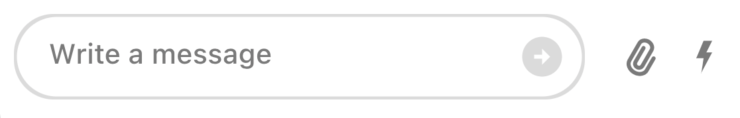

A Widget Dealing With Everything Related To Sending A Message

Find the pub.dev documentation [here](https://pub.dev/documentation/stream_chat_flutter/latest/stream_chat_flutter/StreamMessageInput-class.html)


### Background

In Stream Chat, we can send messages in a channel. However, sending a message isn't as simple as adding
a `TextField` and logic for sending a message. It involves additional processes like addition of media,
quoting a message, adding a custom command like a GIF board, and much more. Moreover, most apps also
need to customize the input to match their theme, overall color and structure pattern, etc.

To do this, we created a `StreamMessageInput` widget which abstracts all expected functionality a modern input
needs - and allows you to use it out of the box.

### Basic Example

A `StreamChannel` is required above the widget tree in which the `StreamMessageInput` is rendered since the channel is
where the messages sent actually go. Let's look at a common example of how we could use the `StreamMessageInput`:

```dart
class ChannelPage extends StatelessWidget {
  const ChannelPage({
    Key key,
  }) : super(key: key);

  @override
  Widget build(BuildContext context) {
    return Scaffold(
      appBar: StreaChannelHeader(),
      body: Column(
        children: <Widget>[
          Expanded(
            child: StreamMessageListView(
              threadBuilder: (_, parentMessage) {
                return ThreadPage(
                  parent: parentMessage,
                );
              },
            ),
          ),
          StreamMessageInput(),
        ],
      ),
    );
  }
}
```

It is common to put this widget in the same page of a `StreamMessageListView` as the bottom widget.

:::note
Make sure to check the [StreamMessageInputController](../04-stream_chat_flutter_core/stream_message_input_controller.mdx) documentation for more information on how to use the controller to manipulate the `StreamMessageInput`.
:::

### Adding Custom Actions

By default, the `StreamMessageInput` has two actions: one for attachments and one for commands like Giphy.
To add your own action, we use the `actions` parameter like this:

```dart
StreamMessageInput(
  actions: [
    InkWell(
      child: Icon(
        Icons.location_on,
        size: 20.0,
        color: StreamChatTheme.of(context).colorTheme.grey,
      ),
      onTap: () {
        // Do something here
      },
    ),
  ],
),
```

This will add on your action to the existing ones.

### Disable Attachments

To disable attachments being added to the message, set the `disableAttachments` parameter to true.

```dart
StreamMessageInput(
    disableAttachments: true,
),
```

### Changing Position Of MessageInput Components

You can also change the position of the TextField, actions and 'send' button relative to each other.

To do this, use the `actionsLocation` or `sendButtonLocation` parameters which help you decide the location
of the buttons in the input.

For example, if we want the actions on the right and the send button inside the TextField, we can do:

```dart
StreamMessageInput(
    sendButtonLocation: SendButtonLocation.inside,
    actionsLocation: ActionsLocation.right,
),
```


