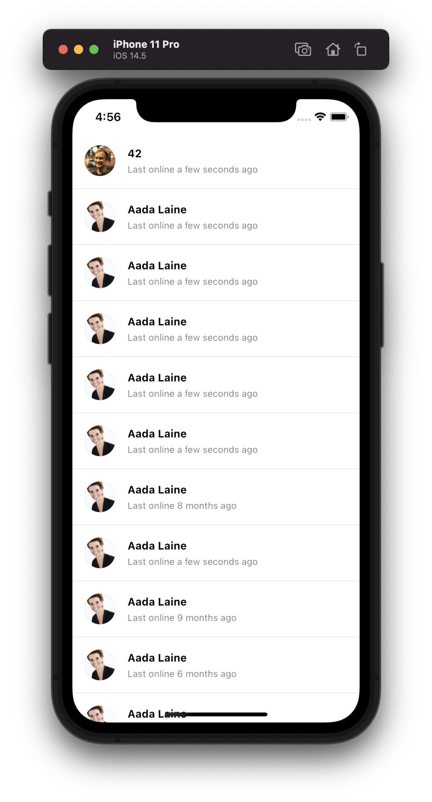

A Widget For Displaying And Selecting Users

Find the pub.dev documentation [here](https://pub.dev/documentation/stream_chat_flutter/latest/stream_chat_flutter/StreamUserListView-class.html)



### Background

A list of users is required for many different purposes: showing a list of users in a Channel,
selecting users to add in a channel, etc. The `StreamUserListView` displays a list
of users.

:::note
Make sure to check the [StreamUserListController](./stream_user_list_controller.mdx) documentation for more information on how to use the controller to manipulate the `StreamUserListView`.
:::

### Basic Example

```dart
class UserListPage extends StatefulWidget {
  const UserListPage({Key? key}) : super(key: key);

  @override
  State<UserListPage> createState() => _UserListPageState();
}

class _UserListPageState extends State<UserListPage> {
  late final StreamUserListController _userListController =
      StreamUserListController(
    client: StreamChat.of(context).client,
    limit: 25,
    filter: Filter.and(
      [Filter.notEqual('id', StreamChat.of(context).currentUser!.id)],
    ),
    sort: [
      const SortOption(
        'name',
        direction: 1,
      ),
    ],
  );

  @override
  Widget build(BuildContext context) {
    return RefreshIndicator(
      onRefresh: () => _userListController.refresh(),
      child: StreamUserListView(
        controller: _userListController,
      ),
    );
  }
}
```

### Customize The User Items

You can use your own widget for the user items using the `itemBuilder` parameter.

```dart
StreamUsersListView(
  // ...
  itemBuilder: (context, users, index, defaultWidget) {
    return Text(user[index].name);
  },
),
```

### Selecting Users

The `StreamUserListView` widget allows selecting users in a list. The `defaultWidget` returned can be customized to indicate that it has been selected.

```dart
Set<User> _selectedUsers = {};

StreamUserListView(
  controller: _userListController,
  itemBuilder: (context, users, index, defaultWidget) {
    return defaultWidget.copyWith(
      selected: _selectedUsers.contains(users[index]),
    );
  },
  onUserTap: (user) {
    setState(() {
      _selectedUsers.add(user);
    });
  },
);
```
