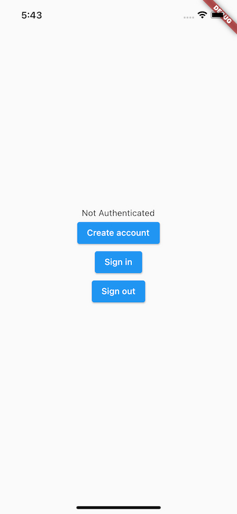
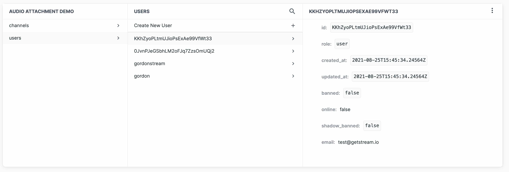

Securely generate Stream Chat user tokens using Firebase Authentication and Cloud Functions.

:::note
This guide assumes that you are familiar with Firebase Authentication and Cloud Functions for Flutter and using the Flutter Stream Chat SDK.
:::

### Introduction

In this guide, you'll explore how you can use Firebase Auth as an authentication provider and create Firebase Cloud functions to securely
generate Stream Chat user tokens.

You will use Stream's [NodeJS client](https://getstream.io/chat/docs/node/?language=javascript) for Stream account creation and
token generation, and [Flutter Cloud Functions for Firebase](https://firebase.flutter.dev/docs/functions/overview) to invoke the cloud functions
from your Flutter app.

Stream supports several different [backend clients](https://getstream.io/chat/sdk/#backend-clients) to integrate with your server. This guide only shows an easy way to integrate Stream Chat authentication using Firebase and Flutter.

### Flutter Firebase

See the [Flutter Firebase getting started](https://firebase.flutter.dev/docs/overview) docs for setup and installation instructions.

You will also need to add the [Flutter Firebase Authentication](https://firebase.flutter.dev/docs/auth/overview), and [Flutter Firebase Cloud Functions](https://firebase.flutter.dev/docs/functions/overview) packages to your app. Depending on the platform that you target, there may be specific configurations that you need to do.

#### Starting Code

The following code shows a basic application with **FirebaseAuth** and **FirebaseFunctions**.

You will extend this later to execute cloud functions.

```dart
import 'package:cloud_functions/cloud_functions.dart';
import 'package:firebase_core/firebase_core.dart';
import 'package:firebase_auth/firebase_auth.dart';
import 'package:flutter/material.dart';
import 'dart:async';

Future<void> main() async {
  WidgetsFlutterBinding.ensureInitialized();
  await Firebase.initializeApp();
  runApp(MyApp());
}

class MyApp extends StatelessWidget {
  @override
  Widget build(BuildContext context) {
    return MaterialApp(
      home: Scaffold(
        body: Auth(),
      ),
    );
  }
}

class Auth extends StatefulWidget {
  Auth({Key? key}) : super(key: key);

  @override
  _AuthState createState() => _AuthState();
}

class _AuthState extends State<Auth> {
  late FirebaseAuth auth;
  late FirebaseFunctions functions;

  @override
  void initState() {
    super.initState();
    auth = FirebaseAuth.instance;
    functions = FirebaseFunctions.instance;
  }

  final email = 'test@getstream.io';
  final password = 'password';

  Future<void> createAccount() async {
    // Create Firebase account
    await auth.createUserWithEmailAndPassword(email: email, password: password);
    print('Firebase account created');
  }

  Future<void> signIn() async {
    // Sign in with Firebase
    await auth.signInWithEmailAndPassword(email: email, password: password);
    print('Firebase signed in');
  }

  Future<void> signOut() async {
    // Revoke Stream chat token.
    final callable = functions.httpsCallable('revokeStreamUserToken');
    await callable();
    print('Stream user token revoked');
  }

  @override
  Widget build(BuildContext context) {
    return Center(
      child: Column(
        mainAxisAlignment: MainAxisAlignment.center,
        children: [
          AuthenticationState(
            streamUser: auth.authStateChanges(),
          ),
          ElevatedButton(
            onPressed: createAccount,
            child: Text('Create account'),
          ),
          ElevatedButton(
            onPressed: signIn,
            child: Text('Sign in'),
          ),
          ElevatedButton(
            onPressed: signOut,
            child: Text('Sign out'),
          ),
        ],
      ),
    );
  }
}

class AuthenticationState extends StatelessWidget {
  const AuthenticationState({
    Key? key,
    required this.streamUser,
  }) : super(key: key);

  final Stream<User?> streamUser;

  @override
  Widget build(BuildContext context) {
    return StreamBuilder<User?>(
      stream: streamUser,
      builder: (context, snapshot) {
        if (snapshot.hasData) {
          return (snapshot.data != null)
              ? Text('Authenticated')
              : Text('Not Authenticated');
        }
        return Text('Not Authenticated');
      },
    );
  }
}

```

Running the above will give this:



The `Auth` widget handles all of the authentication logic. It initializes a `FirebaseAuth.instance` and uses that
in the `createAccount`, `signIn` and `signOut` methods. There is a button to invoke each of these methods.

The `FirebaseFunctions.instance` will be used later in this guide.

The `AuthenticationState` widget listens to `auth.authStateChanges()` to display a message
indicating if a user is authenticated.

### Firebase Cloud Functions

Firebase Cloud Functions allows you to extend Firebase with custom operations that an event can trigger:
- **Internal event**: For example, when creating a new Firebase account this is automatically triggered.
- **External event**: For example, directly calling a cloud function from your Flutter application.

To set up your local environment to deploy cloud functions, please see the
[Cloud Functions getting started](https://firebase.flutter.dev/docs/overview) docs.

After initializing your project with cloud functions, you should have a **functions** folder in your project, including a `package.json` file.

There should be two dependencies already added, **firebase-admin** and **firebase-functions**. You will also need to add the **stream-chat** dependency.

Navigate to the **functions** folder and run `npm install stream-chat --save-prod`.

This will install the node module and add it as a dependency to `package.json`.

Now open `index.js` and add the following (this is the complete example):

```js
const StreamChat = require('stream-chat').StreamChat;
const functions = require("firebase-functions");
const admin = require("firebase-admin");

admin.initializeApp();

const serverClient = StreamChat.getInstance(functions.config().stream.key, functions.config().stream.secret);


// When a user is deleted from Firebase their associated Stream account is also deleted.
exports.deleteStreamUser = functions.auth.user().onDelete((user, context) => {
  return serverClient.deleteUser(user.uid);
});

// Create a Stream user and return auth token.
exports.createStreamUserAndGetToken = functions.https.onCall(async (data, context) => {
  // Checking that the user is authenticated.
  if (!context.auth) {
    // Throwing an HttpsError so that the client gets the error details.
    throw new functions.https.HttpsError('failed-precondition', 'The function must be called ' +
      'while authenticated.');
  } else {
    try {
      // Create user using the serverClient.
      await serverClient.upsertUser({
        id: context.auth.uid,
        name: context.auth.token.name,
        email: context.auth.token.email,
        image: context.auth.token.image,
      });

      /// Create and return user auth token.
      return serverClient.createToken(context.auth.uid);
    } catch (err) {
      console.error(`Unable to create user with ID ${context.auth.uid} on Stream. Error ${err}`);
      // Throwing an HttpsError so that the client gets the error details.
      throw new functions.https.HttpsError('aborted', "Could not create Stream user");
    }
  }
});

// Get Stream user token.
exports.getStreamUserToken = functions.https.onCall((data, context) => {
  // Checking that the user is authenticated.
  if (!context.auth) {
    // Throwing an HttpsError so that the client gets the error details.
    throw new functions.https.HttpsError('failed-precondition', 'The function must be called ' +
      'while authenticated.');
  } else {
    try {
      return serverClient.createToken(context.auth.uid);
    } catch (err) {
      console.error(`Unable to get user token with ID ${context.auth.uid} on Stream. Error ${err}`);
      // Throwing an HttpsError so that the client gets the error details.
      throw new functions.https.HttpsError('aborted', "Could not get Stream user");
    }
  }
});

// Revoke the authenticated user's Stream chat token.
exports.revokeStreamUserToken = functions.https.onCall((data, context) => {
  // Checking that the user is authenticated.
  if (!context.auth) {
    // Throwing an HttpsError so that the client gets the error details.
    throw new functions.https.HttpsError('failed-precondition', 'The function must be called ' +
      'while authenticated.');
  } else {
    try {
      return serverClient.revokeUserToken(context.auth.uid);
    } catch (err) {
      console.error(`Unable to revoke user token with ID ${context.auth.uid} on Stream. Error ${err}`);
      // Throwing an HttpsError so that the client gets the error details.
      throw new functions.https.HttpsError('aborted', "Could not get Stream user");
    }
  }
});

```

First, you import the necessary packages and call `admin.initializeApp();` to set up Firebase cloud functions.

Next, you initialize the **StreamChat** server client by calling `StreamChat.getInstance`. This function requires your Stream app's
**token** and **secret**. You can get this from the Stream Dashboard for your app.

Set these values as environment data on Firebase Functions.

```bash
 firebase functions:config:set stream.key="app-key" stream.secret="app-secret"
```

*Replace **app-key** and **app-secret** with the values for your Stream app.*

This creates an object of **stream** with properties **key** and **secret**. To access this environment
data use `functions.config().stream.key` and `functions.config().stream.secret`.

See the [Firebase environment configuration](https://firebase.google.com/docs/functions/config-env)
documentation for additional information.

To deploy these functions to Firebase, run:

```bash
firebase deploy --only functions
```

### Create a Stream User and Get the User's Token

In the `createStreamUserAndGetToken` cloud function you create an `onCall` HTTPS handler, which exposes
a cloud function that can be invoked from your Flutter app.

```js
// Create a Stream user and return auth token.
exports.createStreamUserAndGetToken = functions.https.onCall(async (data, context) => {
  // Checking that the user is authenticated.
  if (!context.auth) {
    // Throwing an HttpsError so that the client gets the error details.
    throw new functions.https.HttpsError('failed-precondition', 'The function must be called ' +
      'while authenticated.');
  } else {
    try {
      // Create user using the serverClient.
      await serverClient.upsertUser({
        id: context.auth.uid,
        name: context.auth.token.name,
        email: context.auth.token.email,
        image: context.auth.token.image,
      });

      /// Create and return user auth token.
      return serverClient.createToken(context.auth.uid);
    } catch (err) {
      console.error(`Unable to create user with ID ${context.auth.uid} on Stream. Error ${err}`);
      // Throwing an HttpsError so that the client gets the error details.
      throw new functions.https.HttpsError('aborted', "Could not create Stream user");
    }
  }
});
```

This function first does a check to see that the client that calls it is authenticated,
by ensuring that `context.auth` is not null. If it is null, then it throws an `HttpsError` with a descriptive
message. This error can be caught in your Flutter application.

If the caller is authenticated the function proceeds to use the `serverClient` to create a new Stream Chat
user by calling the `upsertUser` method and passing in some user data. It uses the authenticated caller's **`uid`** as an **id**.

After the user is created it generates a token for that user. This token is then returned to the caller.

To call this from Flutter, you will need to use the `cloud_functions` package.

Update the **`createAccount`** method in your Flutter code to the following:

```dart
Future<void> createAccount() async {
  // Create Firebase account
  await auth.createUserWithEmailAndPassword(email: email, password: password);
  print('Firebase account created');

  // Create Stream user and get token
  final callable = functions.httpsCallable('createStreamUserAndGetToken');
  final results = await callable();
  print('Stream account created, token: ${results.data}');
}
```

Calling this method will do the following:
1. Create a new Firebase User and authenticate that user.
2. Call the `createStreamUserAndGetToken` cloud function and get the Stream user token for the authenticated user.

As you can see, calling a cloud function is easy and will also send all the necessary user authentication information (such as the UID)
in the request.

Once you have the Stream user token, you can authenticate your Stream Chat user as you normally would.

Please see our [initialization documentation](https://getstream.io/chat/docs/flutter-dart/init_and_users/?language=dart) for more information.

As you can see below, the User ID matches on both Firebase's and Stream's user database.

##### Firebase Authentication Database


##### Stream Chat User Database




### Get the Stream User Token

The `getStreamUserToken` cloud function is very similar to the `createStreamUserAndGetToken` function. The only difference is
that it only creates a user token and does not create a new user account on Stream.

Update the **`signIn`** method in your Flutter code to the following:

```dart
Future<void> signIn() async {
  // Sign in with Firebase
  await auth.signInWithEmailAndPassword(email: email, password: password);
  print('Firebase signed in');

  // Get Stream user token
  final callable = functions.httpsCallable('getStreamUserToken');
  final results = await callable();
  print('Stream user token retrieved: ${results.data}');
}
```

Calling this method will do the following:
1. Sign in using Firebase Auth.
2. Call the `getStreamUserToken` cloud function to get a Stream user token.

:::note
The user needs to be authenticated to call this cloud function. Otherwise, the function will throw
the **failed-precondition** error that you specified.
:::

### Revoke Stream User Token

You may also want to revoke the Stream user token if you sign out from Firebase.

Update the `signOut` method in your Flutter code to the following:

```dart
Future<void> signOut() async {
  // Revoke Stream user token.
  final callable = functions.httpsCallable('revokeStreamUserToken');
  await callable();
  print('Stream user token revoked');

  // Sign out Firebase.
  await auth.signOut();
  print('Firebase signed out');
}
```
:::note
Call the cloud function before signing out from Firebase.
:::

### Delete Stream User

When deleting a Firebase user account, it would make sense also to delete the
associated Stream user account.

The cloud function looks like this:

```js
// When a user is deleted from Firebase their associated Stream account is also deleted.
exports.deleteStreamUser = functions.auth.user().onDelete((user, context) => {
 return serverClient.deleteUser(user.uid);
});
```

In this function, you are listening to delete events on Firebase auth. When an account is deleted, this function will be triggered, and you can get the
user's **`uid`** and call the `deleteUser` method on the `serverClient`.

This is not an external cloud function; it can only be triggered when an
account is deleted.

### Conclusion

In this guide, you have seen how to securely create Stream Chat tokens using
Firebase Authentication and Cloud Functions.

The principles shown in this guide can be applied to your preferred authentication
provider and cloud architecture of choice.