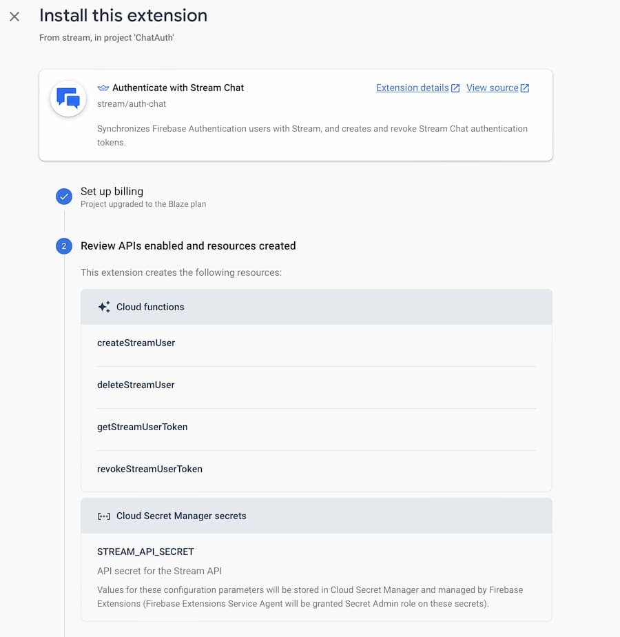

Securely generate Stream Chat user tokens using Firebase Authentication and Cloud Functions.

:::note
This guide assumes that you are familiar with Firebase Authentication and Cloud Functions for Flutter and using the Flutter Stream Chat SDK.
:::

### Introduction

In this guide, you'll explore how you can use Firebase Auth as an authentication provider and create Firebase Cloud functions to securely
generate Stream Chat user tokens.

This guide makes use of Firebase's [Authenticate with Stream Chat](https://firebase.google.com/products/extensions/stream-auth-chat) extension. See [here](https://getstream.io/blog/stream-firebase-extensions/) for additional information on Stream's Firebase extensions.

The Firebase Stream Auth extension manages the Firebase cloud function code needed to create Stream Chat frontend tokens.

Alternatively, you could implement the Firebase cloud functions yourself by making use of our Stream's [NodeJS client](https://getstream.io/chat/docs/node/?language=javascript).
Take a look at the [extension implementation](https://github.com/GetStream/stream-firebase-extensions/tree/main/auth-chat) for additional details. We've also written a [blog post](https://getstream.io/blog/serverless-auth-flutter-firebase/) detailing how you can set this up manually by writing your own cloud functions.

Stream supports several different [backend clients](https://getstream.io/chat/sdk/#backend-clients) to integrate with your server. This guide only shows an automated way to integrate Stream Chat authentication using Firebase and Flutter.

### Flutter Firebase Setup

If you're new to Flutter Firebase, see the [add Firebase to your Flutter app](https://firebase.google.com/docs/flutter/setup?platform=ios) docs for Firebase setup and installation instructions.

You will need to add the [Flutter Firebase Authentication](https://pub.dev/packages/firebase_auth), [Flutter Firebase Cloud Functions](https://pub.dev/packages/cloud_functions), and [Flutter Firebase Core](https://pub.dev/packages/firebase_core) dependencies to your Flutter app.

Add the following dependencies in `pubspec.yaml`:

```yaml
firebase_auth: ^3.3.19
cloud_functions: ^3.2.16
firebase_core: ^1.17.1
```

:::note
This guide uses the above versions. Different versions may have breaking, or other, changes.
:::

### Install Firebase Extensions - Stream Chat Cloud Functions

To follow this guide, you will need to install the Stream Chat Auth Firebase extension in your Firebase project.
This extension automatically provisions your Firebase project with the necessary cloud functions to create and delete Stream user accounts and to generate and revoke user tokens.

1. Go to: https://firebase.google.com/products/extensions/stream-auth-chat
2. Press the **Install in console** button
3. Select the correct Firebase project
4. Follow the installation instructions

:::note
Enabling cloud functions requires you to enable billing (Blaze plan) for your project. You won't be charged unless you reach a certain usage threshold, and you will also be prompted to set up cost limits.
:::

During the installation process you'll be presented with a screen similar to this:



The extensions sets up the following cloud functions:

- createStreamUser
- deleteStreamUser
- getStreamUserToken
- revokeStreamUserToken

Depending on your current project configuration, you may also be promoted to enable **Authentication** and **Secret Manager**. For the extension to work these will need to be enabled, by pressing the **Enable** buttons.


In the final step of the installation you will need to provide your Stream app's API Key and Secret.


1. After entering your Stream Secret, press **Create secret**
2. Press **Install extension**

You can retrieve your app key and secret from your [Stream Project Dashboard](https://dashboard.getstream.io/).


The extension will take a while to be installed, you'll be able to see the installation progress on the **Extensions** tab on Firebase.

Once installed, you'll be able to view information on how the Stream extension works and options to reconfigure it.


This extension automatically creates and deletes a user on Stream when a Firebase user is created or deleted.

It also allows you to generate, and revoke, a Stream frontend token for an authenticated Firebase user:

- **ext-auth-chat-getStreamUserToken**
- **ext-auth-chat-revokeStreamUserToken**

### Flutter Code

The following is the complete Flutter code needed to run a basic example using Firebase Auth and Cloud Functions with your newly installed Stream Chat Firebase extension.

```dart
import 'package:cloud_functions/cloud_functions.dart';
import 'package:firebase_core/firebase_core.dart';
import 'package:firebase_auth/firebase_auth.dart';
import 'package:flutter/material.dart';
import 'dart:async';

import 'package:flutter_firebase_extensions/firebase_options.dart';

Future<void> main() async {
  WidgetsFlutterBinding.ensureInitialized();
  await Firebase.initializeApp(
    options: DefaultFirebaseOptions.currentPlatform,
  );
  runApp(const MyApp());
}

class MyApp extends StatelessWidget {
  const MyApp({Key? key}) : super(key: key);

  @override
  Widget build(BuildContext context) {
    return const MaterialApp(
      home: Scaffold(
        body: Auth(),
      ),
    );
  }
}

class Auth extends StatefulWidget {
  const Auth({Key? key}) : super(key: key);

  @override
  State<Auth> createState() => _AuthState();
}

class _AuthState extends State<Auth> {
  late FirebaseAuth auth;
  late FirebaseFunctions functions;

  @override
  void initState() {
    super.initState();
    auth = FirebaseAuth.instance;
    functions = FirebaseFunctions.instanceFor(region: 'us-central1');
  }

  final email = 'test@getstream.io';
  final password = 'password';

  /// Create User with Firebase and return Stream Token.
  Future<String?> _createAccountAndGetToken() async {
    try {
      await auth.createUserWithEmailAndPassword(
          email: email, password: password);
      print('Firebase account created');

      return _getToken();
    } on FirebaseAuthException catch (error) {
      print(error.code);
      print(error.message);
    }
    return null;
  }

  /// Sign in with Firebase and retrieve Stream chat token.
  Future<String?> _signInAndGetToken() async {
    try {
      await auth.signInWithEmailAndPassword(email: email, password: password);
      print('Firebase signed in');
      return _getToken();
    } on FirebaseAuthException catch (error) {
      print(error.code);
      print(error.message);
    }
    return null;
  }

  /// Sign out of Firebase and revoke Stream chat token.
  Future<void> _signOutAndRevokeToken() async {
    await _revokeToken();

    await auth.signOut();
    print('Firebase Signed Out');
  }

  /// Gets a Stream user token for current authenticated user
  ///
  /// Need to be authenticated to Firebase to call this function.
  Future<String?> _getToken() async {
    try {
      final result = await functions
          .httpsCallable('ext-auth-chat-getStreamUserToken')
          .call();

      print('Stream user token retrieved: ${result.data}');
      return result.data;
    } on FirebaseFunctionsException catch (error) {
      print(error.code);
      print(error.details);
      print(error.message);
    }
    return null;
  }

  /// Revoke Stream user token for current authenticated user.
  ///
  /// Need to be authenticated to Firebase to call this function.
  Future<void> _revokeToken() async {
    try {
      await FirebaseFunctions.instance
          .httpsCallable('ext-auth-chat-revokeStreamUserToken')
          .call();
      print('Stream user token revoked');
    } on FirebaseFunctionsException catch (error) {
      print(error.code);
      print(error.details);
      print(error.message);
    }
  }

  @override
  Widget build(BuildContext context) {
    return Center(
      child: Column(
        mainAxisAlignment: MainAxisAlignment.center,
        children: [
          AuthenticationState(
            streamUser: auth.authStateChanges(),
          ),
          ElevatedButton(
            onPressed: _createAccountAndGetToken,
            child: const Text('Create account'),
          ),
          ElevatedButton(
            onPressed: _signInAndGetToken,
            child: const Text('Sign in'),
          ),
          ElevatedButton(
            onPressed: _signOutAndRevokeToken,
            child: const Text('Sign out'),
          ),
        ],
      ),
    );
  }
}

class AuthenticationState extends StatelessWidget {
  const AuthenticationState({
    Key? key,
    required this.streamUser,
  }) : super(key: key);

  final Stream<User?> streamUser;

  @override
  Widget build(BuildContext context) {
    return StreamBuilder<User?>(
      stream: streamUser,
      builder: (context, snapshot) {
        if (snapshot.hasData) {
          return (snapshot.data != null)
              ? const Text('Authenticated')
              : const Text('Not Authenticated');
        }
        return const Text('Not Authenticated');
      },
    );
  }
}
```

Running the above will show a screen similar to this:


#### Flutter Firebase Authentication

The `Auth` widget handles all of the authentication logic. It initializes a `FirebaseAuth.instance` and uses that
in the `_createAccountAndGetToken`, `_signInAndGetToken` and `_signOutAndRevokeToken` methods. There is a button to invoke each of these methods.

This example uses a hardcoded **email** and **password** and demonstrates basic authentication.

The `AuthenticationState` widget listens to `auth.authStateChanges()` to display a message
indicating if a user is authenticated.

:::note
Ensure that you've enabled the email and password authentication provider within the Firebase Auth console.
:::

#### Flutter Firebase Cloud Functions

Firebase Cloud Functions allows you to extend Firebase with custom operations that an event can trigger:

- **Internal event**: For example, when creating a new Firebase account a function is automatically triggered to create a Stream user.
- **External event**: For example, directly calling a cloud function from your Flutter application - creating/revoking a Stream user token.

To call external cloud functions from Flutter, you will need to use the `cloud_functions` package.

In the code sample given above, in the `initState` method, you're also creating a Firebase function instance:

```dart
functions = FirebaseFunctions.instanceFor(region: 'us-central1');
```

Be sure to set the region to be the same as what you configured your Firebase Chat Auth Extension to use.

#### Create a User and Get the User's Stream Token

Let's explore the code to create a new user and retrieve the frontend token.

The `_createAccountAndGetToken` method does the following:

1. Creates a user on Firebase using the demo credentials
2. An **internal** cloud function is automatically triggered on Firebase to create a new user within your Stream backend app
3. Call the `_getToken` method

Let's explore the `_getToken` method:

```dart
/// Gets a Stream user token for the currently authenticated user
///
/// Need to be authenticated to Firebase to call this function.
Future<String?> _getToken() async {
  try {
    final result = await functions
        .httpsCallable('ext-auth-chat-getStreamUserToken')
        .call();

    print('Stream user token retrieved: ${result.data}');
    return result.data;
  } on FirebaseFunctionsException catch (error) {
    print(error.code);
    print(error.details);
    print(error.message);
  }
  return null;
}
```

:::note
The user needs to be authenticated to call this cloud function. Otherwise, the function will throw
a **failed-precondition** error.
:::

This method calls the `ext-auth-chat-getStreamUserToken` cloud function, which was created automatically when the Stream Firebase extension was installed.
This cloud function will look at the calling user and if they are authenticated to Firebase it will create and return a new frontend user token.

As you can see, calling a cloud function is easy and will also send all the necessary Firebase user authentication information (such as the user UID)
in the request.

Once you have the Stream user token, you can authenticate your Stream Chat user as you normally would. Please see our [initialization documention](https://getstream.io/chat/docs/flutter-dart/init_and_users/?language=dart) for more information.

As you can see below, the **User ID** matches in both Firebase's and Stream's user database.

##### Firebase Authentication Database


##### Stream Chat User Database


#### Login and Get the User's Stream Token

Lets explore the process of user login and token generation within the `_signInAndGetToken` method:

```dart
/// Sign in with Firebase and retrieve Stream chat token.
Future<String?> _signInAndGetToken() async {
  try {
    await auth.signInWithEmailAndPassword(email: email, password: password);
    print('Firebase signed in');
    return _getToken();
  } on FirebaseAuthException catch (error) {
    print(error.code);
    print(error.message);
  }
  return null;
}
```

This process is similar to account creation. Here you sign in using Firebase, and if successful proceed to create a Stream frontend token using the `_getToken` method - which we already explored.

#### Sign Out and Revoke Stream User Token

You probably also want to revoke the Stream user token if you sign out from Firebase.

Let's explore the `_signOutAndRevokeToken` method:

1. This calls, and awaits, the `_revokeToken` method
2. Signs out of Firebase

In the `_revokeToken` method you execute the **ext-auth-chat-revokeStreamUserToken** cloud function:

```dart
/// Revoke Stream user token for current authenticated user.
///
/// Need to be authenticated to Firebase to call this function.
Future<void> _revokeToken() async {
  try {
    await FirebaseFunctions.instance
        .httpsCallable('ext-auth-chat-revokeStreamUserToken')
        .call();
    print('Stream user token revoked');
  } on FirebaseFunctionsException catch (error) {
    print(error.code);
    print(error.details);
    print(error.message);
  }
}
```

:::note
You need to call the cloud function before signing out off Firebase. That is why we `await` the result of `_revokeToken` within `_signOutAndRevokeToken`.
:::

#### Delete Firebase and Stream User

When deleting a Firebase user account, the **ext-auth-chat-deleteStreamUser** cloud function is automatically triggered. This is not an external cloud function; it can only be triggered when an
account is deleted on Firebase itself.

### Conclusion

In this guide, you have seen how to quickly and securely create Stream Chat tokens using
Firebase Authentication and Cloud Functions.
