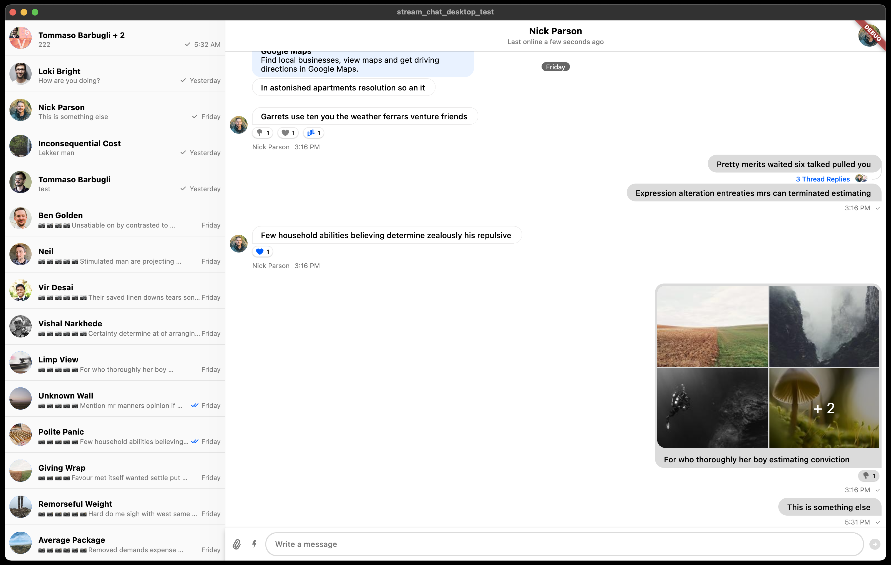

**Version 5.0.0** of the Stream Chat Flutter SDK UI package has been overhauled to support larger screen sizes better and provide native feeling web and desktop platform interactions that feel intuitive and expected.

These newly introduced changes are platform-dependent and will not affect your current Android and iOS builds.

This guide enumerates and better explains the SDK changes introduced in v5.

If you find any bugs or have any questions, please file an [issue on our GitHub repository](https://github.com/GetStream/stream-chat-flutter/issues). We want to support you as much as we can with this migration.

Code examples:

- See our [Stream Chat Flutter tutorial](https://getstream.io/chat/flutter/tutorial/) for an up-to-date guide using the latest Stream Chat version.
- See the [Stream Flutter Samples repository](https://github.com/GetStream/flutter-samples) with our fully-fledged messaging [sample application](https://github.com/GetStream/flutter-samples/tree/main/packages/stream_chat_v1).

Our documentation has also been updated to support v5, so all guides and examples will have updated code.

### Dependencies

To migrate to v5.0.0, update your `pubspec.yaml` with the correct Stream chat package you're using:

```yaml
dependencies:
	stream_chat_flutter: ^5.0.0 # full UI, core and client packages
	stream_chat_flutter_core: ^5.0.0 # core and client packages
	stream_chat: ^5.0.0 # client package
```

---

## Desktop and Web Support: What Changed?

This section highlights our efforts on Desktop (macOS, Windows, and Linux) and Web support.

### Setup

See the [setup guide](../../03-stream_chat_flutter/setup.mdx) for platform specific instructions.

### Supporting Larger Screens

We've added support for larger screens and have made changes to the UI to support larger screen sizes better.

- Widgets are constrained to a maximum size, for example, appropriate message sizing for larger screens.
- UI changes to use larger screen real estate. For example, reactions are added to the bottom of a message on desktop and web.

Below is an example running on macOS, with a split-screen view showing channels on the left and messages on the right.



### Native Platform Interactions

The user experience of interacting with a desktop application differs from a mobile counterpart. There are several factors to consider for an application to feel native and intuitive on the platform it is running, for example:

- Input controls: touch, keyboard, and mouse interactions
- Native file system or gallery access (as well as sharing functionality)
- Shortcuts
- Dialogs

By default, Stream Chat Flutter will use the correct input controls and visual elements for the target platform. For example, touch and swipe controls will be the default on mobile, while on web and desktop these will be disabled and interactions with the mouse and keyboard will be preferred.

On desktop and web it's also possible to add attachments by simply dragging them into the message input box.

### All UI/Behaviour Changes for Desktop and Web

- Right-click context menus for messages and full-screen attachments.
- Upload and download attachments using the native desktop file system.
- Press the "enter" key to send a message.
- If you are quoting a message and have not yet typed any text, you can press the "esc" key to remove the quoted message.
- A dedicated "X" button for removing a quoted message with your mouse.
- Drag and drop attachment files to `StreamMessageInput`.
- New `StreamMessageInput.draggingBorder` property to customize the border color of the message input when dropping a file.
- Message reactions bubbles differ per platform.
- Hovering over a message reaction will show the users that have reacted to the message.
- Desktop attachment sharing UI.
- Selectable message text with mouse input.
- Gallery navigation controls with keyboard shortcuts (left and right arrow keys).
- Appropriate message sizing for large screens.
- Right-click context menu for `StreamMessageListView` items.
- `StreamMessageListView` items not swipeable on desktop & web.
- Video support for Windows & Linux through `dart_vlc`.
- Video support for macOS through `video_player_macos`.
- Replace bottom sheets with dialogs where appropriate.

## What's New?

We improved the overall user experience of the Stream Chat Flutter SDK and added new features to make it easier to customize the SDK to your needs.

We've also fixed several bugs and improved the overall stability of the SDK.

### StreamChatConfiguration

The `StreamChatConfiguration` class is a new inherited widget that allows you to configure the Stream Chat Flutter SDK.

It provides a few configuration options. For example, it lets you specify if you want to `enforceUniqueReactions` or not and allows you to set the `reactionIcons` to use in your app.

You can retrieve the current configuration using `StreamChatConfiguration.of(context)`, as long as there is a `StreamChat` or `StreamChatConfiguration` widget higher up the widget tree. You can provide a custom `StreamChatConfigurationData` directly to `StreamChat` or wrap a section of the widget tree with a `StreamChatConfiguration`.

For additional information, see [#1125](https://github.com/GetStream/stream-chat-flutter/issues/1125). The `defaultUserImage`, `placeholderUserImage`, `reactionIcons`, and `enforceUniqueReactions` have been refactored out of `StreamChatThemeData` and into the new`StreamChatConfigurationData` class.

### StreamMemberListView and StreamMemberGridView

The `StreamMemberListView` and `StreamMemberGridView` widgets are new widgets that allow you to display a list of members in a channel.

Check out the dedicated [documentation](../../03-stream_chat_flutter/stream_member_list_view.mdx) for more information.

### Attachment Picker

As part of the v5 release, we've refactored the `AttachmentPicker` to be more flexible and customizable. This allows you to use the `AttachmentPicker` in various ways and customize the UI to your liking.

Check out the dedicated [guide](../../02-customization/01-custom-widgets/05-customize_attachment_picker_modal.mdx) for more information.

### Other Changes

The following was also introduced:

- Added support for additional text field params in`StreamMessageInput`: `maxLines`, `minLines`, `textInputAction`, `keyboardType`, and `textCapitalization`.
- Added `showStreamAttachmentPickerModalBottomSheet` to show the attachment picker modal bottom sheet.
- Added `onQuotedMessageCleared` to `StreamMessageInput`
- `selected` and `selectedTileColor` to `StreamChannelListTile`
- Added `AttachmentUploadStateBuilder.inProgressBuilder` to `AttachmentUploadStateBuilder`
- Added `AttachmentUploadStateBuilder.successBuilder` to `AttachmentUploadStateBuilder`
- Added `AttachmentUploadStateBuilder.failedBuilder` to `AttachmentUploadStateBuilder`
- Added `StreamAutocomplete` widget for auto-complete triggers in `StreamMessageInput`.
- Added `StreamMessageInput.customAutocompleteTriggers` to allow users to define their custom triggers.

New translations:

- `couldNotReadBytesFromFileError`
- `downloadLabel`
- `toggleMuteUnmuteAction`
- `toggleMuteUnmuteGroupQuestion`
- `toggleMuteUnmuteGroupText`
- `toggleMuteUnmuteUserQuestion`
- `toggleMuteUnmuteUserText`

## Deprecated

The following components have been deprecated in v5.0.0:

- Deprecated `showConfirmationDialog` in favor of `showConfirmationBottomSheet`
- Deprecated `showInfoDialog` in favor of `showInfoBottomSheet`
- Deprecated `wrapAttachmentWidget` in favor of the `WrapAttachmentWidget` class

## Breaking changes

The following components have been removed in v5.0.0:

- `StreamImageAttachment.size` has been removed in favor of `StreamImageAttachment.constraints`.
- `StreamFileAttachment.size` has been removed in favor of `StreamFileAttachment.constraints`.
- `StreamGiphyAttachment.size` has been removed in favor of `StreamGiphyAttachment.constraints`.
- `StreamVideoAttachment.size` has been removed in favor of `StreamVideoAttachment.constraints`.
- `StreamVideoThumbnailImage.width` and `StreamVideoThumbnailImage.height` have been removed in favor of `StreamVideoThumbnailImage.constraints`.

To fix these deprecations in your code, you can use a `BoxConstraints.tight` passing the desired fixed size as a parameter.

```dart
/// BEFORE
StreamImageAttachment(
  size: size,
)

/// AFTER
StreamImageAttachment(
  constraints: BoxConstraints.tight(size),
)
```

- Removed `StreamMessageInput.customOverlays` in favor of `StreamMessageInput.customAutocompleteTriggers`. Read the guide on [Adding Custom Autocomplete Triggers](../../02-customization/01-custom-widgets/06-autocomplete_triggers.mdx) to learn how to migrate your code.

- Removed the default emoji overlay picker. Read the guide on [Adding Custom Autocomplete Triggers](../../02-customization/01-custom-widgets/06-autocomplete_triggers.mdx) to learn how to migrate your code.
