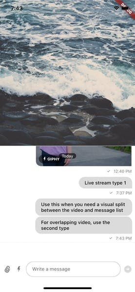
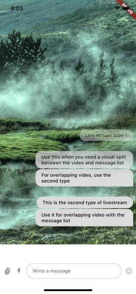

Adding Chat To Video Livestreams

### Introduction

Video livestreams are usually complemented with a chat section to make the livestream more interactive
and encourage retention. There are several ways to show the chat interface on the screen and requires
some design choices.

This guide details multiple ways of adding chat functionality to your video livestream.

### Implementing Chat

There are two common scenarios in live-streaming applications depending how well integrated the two
components (video + chat) are allowed to be on the screen. Two common types are split-screen and a
chat overlay that fades in.

Let's explore creating both types:

### Split-screen

In the split-screen implementation, we have a visual split between the video and the message list.
This allows the content to be unobstructed by chat and have a clear separation of boundaries.



```dart
Scaffold(
  body: Column(
    children: <Widget>[
      Expanded(
        child: // Your video implementation here,
      ),
      Expanded(
        child: Column(
          children: [
           Expanded(
             child: MessageListView(),
           ),
           MessageInput(),
          ],
        ),
      ),
    ],
  ),
)
```

### Overlapping chat with a transparency gradient

Another way to add chat is to overlay the video content with messages which progressively fade out
as we go to the top of the screen. This gives the content a more rich feel as it takes the whole
screen and allows the chat to be more homogeneously integrated with the content.

The second type looks like this:



We can use a `Stack` for achieving this, here's a complete working implementation:

```dart
class MyApp extends StatelessWidget {
  const MyApp({
    Key? key,
    required this.client,
    required this.channel,
  }) : super(key: key);

  final StreamChatClient client;

  final Channel channel;

  @override
  Widget build(BuildContext context) => MaterialApp(
        theme: ThemeData.light(),
        darkTheme: ThemeData.dark(),
        builder: (context, widget) => StreamChat(
          client: client,
          child: widget,
          streamChatThemeData: StreamChatThemeData().copyWith(
            messageListViewTheme: const MessageListViewThemeData(
              backgroundColor: Colors.transparent,
            ),
          ),
        ),
        home: StreamChannel(
          channel: channel,
          child: const ChannelPage(),
        ),
      );
}

class ChannelPage extends StatelessWidget {
  const ChannelPage({
    Key? key,
  }) : super(key: key);

  @override
  Widget build(BuildContext context) {
    return Scaffold(
      backgroundColor: Colors.transparent,
      body: Stack(
        children: <Widget>[
          // Add your video implementation here
          ShaderMask(
            shaderCallback: (rect) {
              return const LinearGradient(
                  begin: Alignment.bottomCenter,
                  end: Alignment.topCenter,
                  colors: [Colors.black, Colors.transparent],
                  stops: [0.4, 0.8]).createShader(
                Rect.fromLTRB(0, 0, rect.width, rect.height),
              );
            },
            blendMode: BlendMode.dstIn,
            child: Column(
              children: const [
                Expanded(
                  child: MessageListView(),
                ),
                MessageInput(),
              ],
            ),
          ),
        ],
      ),
    );
  }
}
```