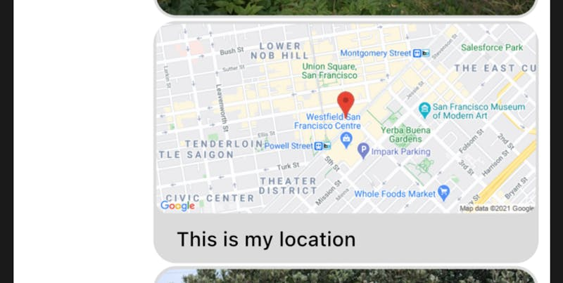

Adding Your Own Types Of Attachments To A Message

### Introduction

Stream Chat supports attachment types like images, video and files by default. You can also add your
own types of attachments through the SDK such as location, audio, etc.

This involves doing three things:

1) Rendering the attachment thumbnail in the `MessageInput`

2) Sending a message with the custom attachment

3) Rendering the custom message attachment

To do this, let's check out an example to add location sharing to Stream Chat.

### Location Sharing

Let's build an example of location sharing option in the app:


* Show a "Share Location" button next to MessageInput Textfield.

* When the user presses this button, it should fetch the current location coordinates of the user, and send a message on the channel as follows:

```dart
Message(
  text: 'This is my location',
  attachments: [
    Attachment(
      uploadState: UploadState.success(),
      type: 'location',
      extraData: {
        'latitude': 'fetched_latitude',
        'longitude': 'fetched_longitude',
      },
    ),
  ],
)
```

For our example, we are going to use [geolocator](https://pub.dev/packages/geolocator) library.
Please check their [setup instructions](https://pub.dev/packages/geolocator) on their docs.

NOTE: If you are testing on iOS simulator, you will need to set some dummy coordinates, as mentioned [here](https://stackoverflow.com/a/31238119/7489541).
Also don't forget to enable "location update" capability in background mode, from XCode.

On the receiver end, `location` type attachment should be rendered in map view, in the `MessageListView`.
We are going to use [Google Static Maps API](https://developers.google.com/maps/documentation/maps-static/overview) to render the map in the message.
You can use other libraries as well such as [google_maps_flutter](https://pub.dev/packages/google_maps_flutter).

First, we add a button which when clicked fetches and shares location into the `MessageInput`:

```dart
MessageInput(
  actions: [
    InkWell(
      child: Icon(
        Icons.location_on,
        size: 20.0,
        color: StreamChatTheme.of(context).colorTheme.grey,
      ),
      onTap: () {
       var channel = StreamChannel.of(context).channel;
       var user = StreamChat.of(context).user;

       _determinePosition().then((value) {
         channel.sendMessage(
           Message(
             text: 'This is my location',
             attachments: [
               Attachment(
                 uploadState: UploadState.success(),
                 type: 'location',
                 extraData: {
                   'latitude': value.latitude.toString(),
                   'longitude': value.longitude.toString(),
                 },
               ),
             ],
           ),
         );
       }).catchError((err) {
        print('Error getting location!');
       });
      },
    ),
  ],
),

Future<Position> _determinePosition() async {
  bool serviceEnabled;
  LocationPermission permission;

  serviceEnabled = await Geolocator.isLocationServiceEnabled();
  if (!serviceEnabled) {
    return Future.error('Location services are disabled.');
  }

  permission = await Geolocator.checkPermission();
  if (permission == LocationPermission.denied) {
    permission = await Geolocator.requestPermission();
    if (permission == LocationPermission.deniedForever) {
      return Future.error(
          'Location permissions are permanently denied, we cannot request permissions.');
    }

    if (permission == LocationPermission.denied) {
      return Future.error(
          'Location permissions are denied');
    }
  }

  return await Geolocator.getCurrentPosition();
}
```

Next, we build the Static Maps URL (Add your API key before using the code snippet):

```dart
  String _buildMapAttachment(String lat, String long) {
    var baseURL = 'https://maps.googleapis.com/maps/api/staticmap?';
    var url = Uri(
        scheme: 'https',
        host: 'maps.googleapis.com',
        port: 443,
        path: '/maps/api/staticmap',
        queryParameters: {
          'center': '${lat},${long}',
          'zoom': '15',
          'size': '600x300',
          'maptype': 'roadmap',
          'key': 'YOUR_API_KEY',
          'markers': 'color:red|${lat},${long}'
        });

    return url.toString();
  }
```

And then modify the MessageListView and tell it how to build a location attachment:

```dart
MessageListView(
  customAttachmentBuilders: {
    'location': (context, message, attachments) {
       var attachmentWidget = Image.network(
         _buildMapAttachment(
           attachments[0].extraData['latitude'],
           attachments[0].extraData['longitude'],
         ),
       );

      return wrapAttachmentWidget(context, attachmentWidget, null, true, BorderRadius.circular(8.0));
    }
  },
),
```

This gives us the final location attachment:



Additionally, you can also add a thumbnail if a message has a location attachment (unlike in this case, where we sent the message directly).

To do this, we will:

1) Add an attachment instead of sending a message

2) Customize the `MessageInput`

First, we add the attachment when the location button is clicked:

```dart
 GlobalKey<MessageInputState> _messageInputKey = GlobalKey();

 MessageInput(
   key: _messageInputKey,
   actions: [
     InkWell(
       child: Icon(
         Icons.location_on,
         size: 20.0,
         color: StreamChatTheme.of(context).colorTheme.grey,
        ),
      onTap: () {
        _determinePosition().then((value) {
           _messageInputKey.currentState.addAttachment(
              Attachment(
                uploadState: UploadState.success(),
                type: 'location',
                extraData: {
                  'latitude': value.latitude.toString(),
                  'longitude': value.longitude.toString(),
                },
              ),
           );
         }).catchError((err) {
           print('Error getting location!');
         });
       },
     ),
   ],
 ),
```

After this, we can build the thumbnail:

```dart
MessageInput(
  key: _messageInputKey,
  actions: [
    InkWell(
      child: Icon(
        Icons.location_on,
        size: 20.0,
        color: StreamChatTheme.of(context).colorTheme.grey,
      ),
     onTap: () {
       _determinePosition().then((value) {
         _messageInputKey.currentState.addAttachment(
           Attachment(
             uploadState: UploadState.success(),
             type: 'location',
             extraData: {
               'latitude': value.latitude.toString(),
               'longitude': value.longitude.toString(),
             },
           ),
         );
       }).catchError((err) {
          print('Error getting location!');
       });
     },
   ),
  ],
  attachmentThumbnailBuilders: {
    'location': (context, attachment) {
      return Image.network(
        _buildMapAttachment(
          attachment.extraData['latitude'],
          attachment.extraData['longitude'],
        ),
      );
    },
  },
),
```

And we can see the thumbnails in the MessageInput:


