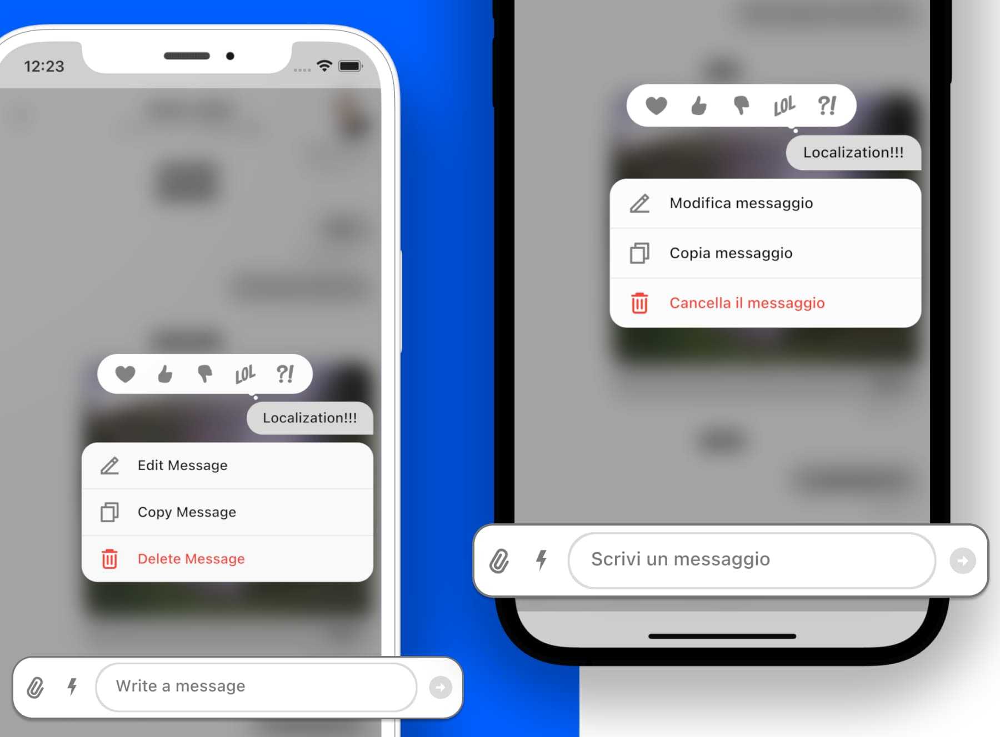

Adding Localization To UI Widgets

### Introduction

We have a dedicated package for adding localization to our UI widgets. It's called `stream_chat_localizations` and you can find it [here](https://pub.dev/packages/stream_chat_localizations).



## What is Localization?

If you deploy your app to users who speak another language, you'll need to internationalize (localize) it. That means you need to write the app in a way that makes it possible to localize values like text and layouts for each language or locale that the app supports. For more information, see the [Flutter documentation](https://flutter.dev/docs/development/accessibility-and-localization/**internationalization**).

What this package allows you to do is to provide localized strings for the Stream chat widgets. For example, depending on the application locale, the Stream Chat widgets will display the appropriate language. The locale will be set automatically, based on system preferences, or you could set it programmatically in your app. The package supports several different languages, with more to be added. The package allows you to override any supported language or add a new language that isn't supported.

### Supported languages

At the moment we support the following languages:
- [English](https://github.com/GetStream/stream-chat-flutter/blob/master/packages/stream_chat_localizations/lib/src/stream_chat_localizations_en.dart)
- [Hindi](https://github.com/GetStream/stream-chat-flutter/blob/master/packages/stream_chat_localizations/lib/src/stream_chat_localizations_hi.dart)
- [Italian](https://github.com/GetStream/stream-chat-flutter/blob/master/packages/stream_chat_localizations/lib/src/stream_chat_localizations_it.dart)
- [French](https://github.com/GetStream/stream-chat-flutter/blob/master/packages/stream_chat_localizations/lib/src/stream_chat_localizations_fr.dart)
- [Spanish](https://github.com/GetStream/stream-chat-flutter/blob/master/packages/stream_chat_localizations/lib/src/stream_chat_localizations_es.dart)
- [Japanese](https://github.com/GetStream/stream-chat-flutter/blob/master/packages/stream_chat_localizations/lib/src/stream_chat_localizations_ja.dart)
More languages will be added in the future. Feel free to [contribute](https://github.com/GetStream/stream-chat-flutter/blob/master/CONTRIBUTING.md) to add more languages.

### Add dependency

Add this to your package's `pubspec.yaml` file, use the latest version [](https://pub.dartlang.org/packages/stream_chat_localizations)
```yaml
dependencies:
 stream_chat_localizations: ^latest_version
```

Then run `flutter packages get`

### Usage

Generally, Flutter and the Stream Chat SDK will use the system locale of the user's device, if that locale is supported (see below). If the locale is not supported we will default to `en`.
Make sure to read more about localization in the [official Flutter docs](https://flutter.dev/docs/development/accessibility-and-localization/internationalization).

```dart
import 'package:flutter/material.dart';
import 'package:stream_chat_localizations/stream_chat_localizations.dart';

void main() {
  WidgetsFlutterBinding.ensureInitialized();
  runApp(MyApp());
}

class MyApp extends StatelessWidget {
  @override
  Widget build(BuildContext context) {
    return MaterialApp(
      // Add all the supported locales
      supportedLocales: const [
        Locale('en'),
        Locale('hi'),
        Locale('fr'),
        Locale('it'),
        Locale('es'),
        Locale('ja'),
      ],
      // Add GlobalStreamChatLocalizations.delegates
      localizationsDelegates: GlobalStreamChatLocalizations.delegates,
      builder: (context, widget) => StreamChat(
        client: client,
        child: widget,
      ),
      home: StreamChannel(
        channel: channel,
        child: const ChannelPage(),
      ),
    );
  }
}
```

## Setting a language
The application language can be changed through system preferences or programmatically.

### System Preferences
The application locale can be changed by changing the language for your device or emulator within the device's system preferences.

[iOS change language](https://support.apple.com/en-us/HT204031)

[Android change language](https://support.google.com/websearch/answer/3333234?co=GENIE.Platform%3DAndroid&hl=en)

Note that the language needs to be supported in your application to work.

### Programmatically
You can also set the locale programmatically in your Flutter application without changing the device's language.

```dart
return MaterialApp(
 ...
 locale: const Locale('fr'),
 ...
);
```

There are many ways that this can be set for additional control. For information and examples, see this [Stack Overflow post](https://stackoverflow.com/questions/49441212/flutter-multi-lingual-application-how-to-override-the-locale).

### Adding a new language

To add a new language, create a new class extending `GlobalStreamChatLocalizations` and create a delegate for it, adding it to the `delegates` array.

Check out [this example](https://github.com/GetStream/stream-chat-flutter/blob/master/packages/stream_chat_localizations/example/lib/add_new_lang.dart) to see how to add a new language.

### Override existing languages

To override an existing language, create a new class extending that particular language class and create a delegate for it, adding it to the `delegates` array.

Check out [this example](https://github.com/GetStream/stream-chat-flutter/blob/master/packages/stream_chat_localizations/example/lib/override_lang.dart) to see how to override an existing language.

### Changing the default language

To change the default language you can use the `MaterialApp.localeListResolutionCallback` property.
Here is an example of how that would look like:

```dart
    MaterialApp(
        theme: ThemeData.light(),
        darkTheme: ThemeData.dark(),
        // Add all the supported locales
        supportedLocales: const [
            Locale('en'),
            Locale('hi'),
            Locale('fr'),
            Locale('it'),
            Locale('es'),
            Locale('ja'),
        ],
        // locales are the locales of the device
        // supportedLocales are the app supported locales
        localeListResolutionCallback: (locales, supportedLocales) {
            // We map the supported locales to language codes
            // note that this is completely optional and this logic can be changed as you like
            final supportedLanguageCodes =
                supportedLocales.map((e) => e.languageCode);
            if (locales != null) {
                // we iterate over the locales and find the first one that is supported
                for (final locale in locales) {
                    if (supportedLanguageCodes.contains(locale.languageCode)) {
                        return locale;
                    }
                }
            }

            // if we didn't find a supported language, we return the Italian language
            return const Locale('it');
        },
        // Add GlobalStreamChatLocalizations.delegates
        localizationsDelegates: GlobalStreamChatLocalizations.delegates,
        ...

```

In this case, we're using Italian as the default language.

### ⚠️ Note on **iOS**

For translation to work on **iOS** you need to add supported locales to 
`ios/Runner/Info.plist` as described [here](https://flutter.dev/docs/development/accessibility-and-localization/internationalization#specifying-supportedlocales).

Example:

```xml
<key>CFBundleLocalizations</key>
<array>
	<string>en</string>
	<string>nb</string>
	<string>fr</string>
	<string>it</string>
  <string>es</string>
  <string>ja</string>
</array>
```
