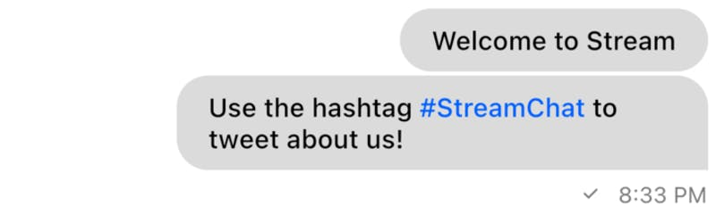

Customizing Text Messages

### Introduction

Every application provides a unique look and feel to their own messaging interface including and not
limited to fonts, colors, and shapes.

This guide details how to customize text messages in the `MessageListView` in the Stream Chat Flutter
UI SDK.

:::note
This guide is specifically for the `MessageListView` but if you intend to display a `MessageWidget`
separately, follow the same process without the `.copyWith` and use the default constructor instead.
:::

### Basics of customizing a `MessageWidget`

First, add a `MessageListView` in the appropriate place where you intend to display messages from a
channel.

```
MessageListView(
    ...
)
```

Now, we use the `messageBuilder` parameter to build a custom message. The builder function also provides
the default implementation of the `MessageWidget` so that we can change certain aspects of the widget
without redoing all of the default parameters.

:::note
In earlier versions of the SDK, some `MessageWidget` parameters were exposed directly through the `MessageListView`,
however, this quickly becomes hard to maintain as more parameters and customizations are added to the
`MessageWidget`. Newer version utilise a cleaner interface to change the parameters by supplying a
default message implementation as aforementioned.
:::

```
MessageListView(
    ...
    messageBuilder: (context, messageDetails, messageList, defaultWidget) {
        return defaultWidget;
    },
)
```

We use `.copyWith()` to customize the widget:

```
MessageListView(
    ...
    messageBuilder: (context, messageDetails, messageList, defaultWidget) {
        return defaultWidget.copyWith(
            ...
        );
    },
)
```

### Customizing text

If you intend to simply change the theme for the text, you need not recreate the whole widget. The
`MessageWidget` has a `messageTheme` parameter that allows you to pass the theme for most aspects
of the message.

```
MessageListView(
    ...
    messageBuilder: (context, messageDetails, messageList, defaultWidget) {
        return defaultWidget.copyWith(
            messageTheme: MessageTheme(
                ...
                messageText: TextStyle(),
            ),
        );
    },
)
```

If you want to replace the entire text widget in the `MessageWidget`, you can use the `textBuilder`
parameter which provides a builder for creating a widget to substitute the default text.parameter

```
MessageListView(
    ...
    messageBuilder: (context, messageDetails, messageList, defaultWidget) {
        return defaultWidget.copyWith(
            textBuilder: (context, message) {
                return Text(message.text);
            },
        );
    },
)
```

### Adding Hashtags

To add elements like hashtags, we can override the `textBuilder` in the MessageWidget:

```
MessageListView(
    ...
    messageBuilder: (context, messageDetails, messageList, defaultWidget) {
        return defaultWidget.copyWith(
            textBuilder: (context, message) {
                final text = _replaceHashtags(message.text).replaceAll('\n', '\\\n');
                final messageTheme = StreamChatTheme.of(context).ownMessageTheme;

                return MarkdownBody(
                    data: text,
                    onTapLink: (
                        String link,
                        String href,
                        String title,
                        ) {
                      // Do something with tapped hashtag
                    },
                    styleSheet: MarkdownStyleSheet.fromTheme(
                      Theme.of(context).copyWith(
                        textTheme: Theme.of(context).textTheme.apply(
                          bodyColor: messageTheme.messageText.color,
                          decoration: messageTheme.messageText.decoration,
                          decorationColor: messageTheme.messageText.decorationColor,
                          decorationStyle: messageTheme.messageText.decorationStyle,
                          fontFamily: messageTheme.messageText.fontFamily,
                        ),
                      ),
                    ).copyWith(
                      a: messageTheme.messageLinks,
                      p: messageTheme.messageText,
                    ),
                );
            },
        );
    },
)

String _replaceHashtags(String text) {
  RegExp exp = new RegExp(r"\B#\w\w+");
  exp.allMatches(text).forEach((match){
    text = text.replaceAll(
        '${match.group(0)}', '[${match.group(0)}](${match.group(0).replaceAll(' ', '')})');
  });
  return text;
}
```

We can replace the hashtags using RegEx and add links for the MarkdownBody which is done here in the
`_replaceHashtags()` function.
Inside the textBuilder, we use the `flutter_markdown` package to build our hashtags as links.


