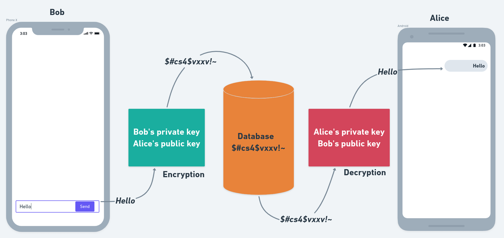

## Introduction

When you communicate over a chat application with another person or group,
you may exchange sensitive information, like personally identifiable information, financial details, or passwords.
To ensure that your data stays secure, a chat application must use end-to-end encryption.

:::note
Before you start, keep in mind that this guide is a basic example intended for educational purposes only.
If you want to implement end-to-end encryption in your production app, please consult a security professional first.
There’s a lot more to consider from a security perspective that isn’t covered here.
:::

## What is End-to-End Encryption?

End-to-end encryption (E2EE) is the process of securing a message from third parties so that only the sender and receiver can access the message.
E2EE provides security by storing the message in an encrypted form on the server or database running the application.

You can only access the message by decrypting and signing it using a known public key (distributed freely)
and a corresponding private key (only known by the owner).

Each user in the application has their own public-private key pair.
Public keys are distributed publicly and encrypt the sender’s messages.
The receiver can only decrypt the sender’s message with the matching private key, which is used to decrypt messages and to verify or sign them.

Check out the diagram below for an example:



## Setup

### Add dependency

Add the [webcrypto](https://pub.dev/packages/webcrypto) package in your pubspec.yaml.

```dart
dependencies:
  webcrypto: ^0.5.2 # latest version
```

### Generate key pair

We will write a function that generates a key pair using the ECDH algorithm and the P-256 elliptic curve (P-256 is well-supported and
offers the right balance of security and performance).

The pair will consist of two keys
1. PublicKey: The key we will link and send with every user in order to encrypt message.
2. PrivateKey: The key we will store locally to decrypt messages.

```dart
Future<JsonWebKeyPair> generateKeys() async {
  final keyPair = await EcdhPrivateKey.generateKey(EllipticCurve.p256);
  final publicKeyJwk = await keyPair.publicKey.exportJsonWebKey();
  final privateKeyJwk = await keyPair.privateKey.exportJsonWebKey();

  return JsonWebKeyPair(
    privateKey: json.encode(privateKeyJwk),
    publicKey: json.encode(publicKeyJwk),
  );
}

// Model class for storing keys
class JsonWebKeyPair {
  const JsonWebKeyPair({
    required this.privateKey,
    required this.publicKey,
  });

  final String privateKey;
  final String publicKey;
}
```

### Generate a Crypto Key

The symmetric Crypto Key is generated using the keys generated in the previous step.
We will use those keys to encrypt and decrypt messages.

```dart
// SendersJwk -> sender.privateKey
// ReceiverJwk -> receiver.publicKey
Future<List<int>> deriveKey(String senderJwk, String receiverJwk) async {
  // Sender's key
  final senderPrivateKey = json.decode(senderJwk);
  final senderEcdhKey = await EcdhPrivateKey.importJsonWebKey(
    senderPrivateKey,
    EllipticCurve.p256,
  );

  // Receiver's key
  final receiverPublicKey = json.decode(receiverJwk);
  final receiverEcdhKey = await EcdhPublicKey.importJsonWebKey(
    receiverPublicKey,
    EllipticCurve.p256,
  );

  // Generating CryptoKey
  final derivedBits = await senderEcdhKey.deriveBits(256, receiverEcdhKey);
  return derivedBits;
}
```

### Encrypting Messages

Once we have generated the Crypto Key, we’re ready to encrypt the message.
We can use the AES-GCM algorithm for its known security/performance balance and browser availability.

```dart
// The "iv" stands for initialization vector (IV). To ensure the encryption’s strength,
// each encryption process must use a random and distinct IV.
// It’s included in the message so that the decryption procedure can use it.
final Uint8List iv = Uint8List.fromList('Initialization Vector'.codeUnits);
```

```dart
Future<String> encryptMessage(String message, List<int> deriveKey) async {
  // Importing cryptoKey
  final aesGcmSecretKey = await AesGcmSecretKey.importRawKey(deriveKey);

  // Converting message into bytes
  final messageBytes = Uint8List.fromList(message.codeUnits);

  // Encrypting the message
  final encryptedMessageBytes =
      await aesGcmSecretKey.encryptBytes(messageBytes, iv);

  // Converting encrypted message into String
  final encryptedMessage = String.fromCharCodes(encryptedMessageBytes);
  return encryptedMessage;
}
```

### Decrypting Messages

Decrypting a message is the opposite of encrypting one.
To decrypt a message to a human-readable format, use the code snippet below:

```dart
Future<String> decryptMessage(String encryptedMessage, List<int> deriveKey) async {
  // Importing cryptoKey
  final aesGcmSecretKey = await AesGcmSecretKey.importRawKey(deriveKey);

  // Converting message into bytes
  final messageBytes = Uint8List.fromList(encryptedMessage.codeUnits);

  // Decrypting the message
  final decryptedMessageBytes =
      await aesGcmSecretKey.decryptBytes(messageBytes, iv);

  // Converting decrypted message into String
  final decryptedMessage = String.fromCharCodes(decryptedMessageBytes);
  return decryptedMessage;
}
```

## Implement as a Stream Chat Feature

Now that our setup is complete, let's use it to implement end-to-end encryption in our app.

### Store User's PublicKey

The first thing we will do is to store the generated `publicKey` as a `extraData` property, in order
for other user's to use it for encrypting the messages.

```dart
// Generating keyPair using the function defined in above steps
final keyPair = generateKeys();
```

```dart
await client.connectUser(
  User(
    id: 'cool-shadow-7',
    name: 'Cool Shadow',
    image: 'https://getstream.io/cool-shadow',

    // set publicKey as a extraData property
    extraData: { 'publicKey': keyPair.publicKey },
  ),
  client.devToken('cool-shadow-7').rawValue,
);
```

### Sending Encrypted Messages

Now we will use the `encryptMessage()` function created in our previous steps to encrypt the message.

To do that, we will also make some minor changes in our `MessageInput` widget.

```dart
final receiverJwk = receiver.extraData['publicKey'];

// Generating derivedKey using user's privateKey and receiver's publicKey
final derivedKey = await deriveKey(keyPair.privateKey, receiverJwk);
```

```dart
MessageInput(
  ...
  preMessageSending: (message) async {
    // Encrypting the message text using derivedKey
    final encryptedMessage = await encryptMessage(message.text, derivedKey);

    // Creating a new message with the encrypted message text
    final newMessage = message.copyWith(text: encryptedMessage);

    return newMessage;
  },
),
```

`preMessageSending` is a parameter that allows your app to process the message before it goes to Stream’s server.
Here, we have used it to encrypt the message before sending it to Stream’s backend.

### Showing Decrypted Messages

Now, it’s time to decrypt the message and present it in a human-readable format to the receiver.

We will customize the `MessageListView` widget to have your own `messagebuilder`, including a method to decrypt messages.

```dart
MessageListView(
  ...
  messageBuilder: (context, messageDetails, currentMessages, defaultWidget) {
    // Retrieving the message from details
    final message = messageDetails.message;

    // Decrypting the message text using the derivedKey
    final decryptedMessageFuture = decryptMessage(message.text, derivedKey);
    return FutureBuilder<String>(
      future: decryptedMessageFuture,
      builder: (context, snapshot) {
        if (snapshot.hasError) return Text('Error: ${snapshot.error}');
        if (!snapshot.hasData) return Container();

        // Updating the original message with the decrypted text
        final decryptedMessage = message.copyWith(text: snapshot.data);

        // Returning defaultWidget with updated message
        return defaultWidget.copyWith(
          message: decryptedMessage,
        );
      },
    );
  },
),
```

That’s it! that's all we need to do add E2EE in a Stream powered chat app.
For more details, checkout this [blogpost](https://getstream.io/blog/end-to-end-encrypted-chat-in-flutter/#whats-end-to-end-encryption) on our Stream blog.
