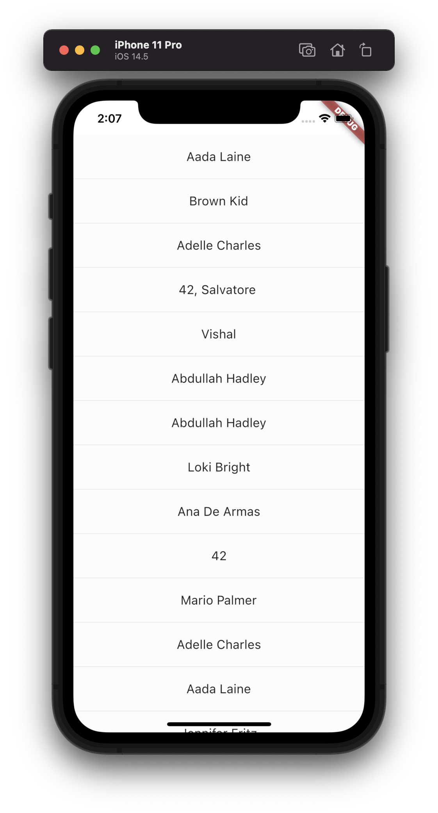
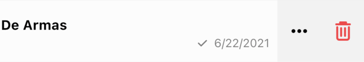

A Widget For Displaying A List Of Channels

Find the pub.dev documentation [here](https://pub.dev/documentation/stream_chat_flutter/latest/stream_chat_flutter/ChannelListView-class.html)

### Background

Channels are fundamental elements of Stream Chat and constitute shared spaces which allow users to
message each other. 1:1 conversations and groups are both examples of channels, albeit with some (distinct/non-distinct)
differences. Displaying the list of channels that a user is a part of is a pattern that is part of
most messaging apps.

The `ChannelListView` widget allows displaying a list of channels to a user. By default, this is NOT
ONLY the channels that the user is a part of. This section goes into setting up and using a `ChannelListView`
widget.

### Basic Example

Here is a basic example of the `ChannelListView` widget. It consists of the main widget itself, a `Filter`
to filter only the channels that the user is a part of, sorting by last message time, pagination params,
and the widget to use when a particular channel is clicked.

```dart
class ChannelListPage extends StatelessWidget {
  @override
  Widget build(BuildContext context) {
    return Scaffold(
      body: ChannelListView(
        filter: Filter.in_('members', [StreamChat.of(context).user.id]),
        sort: [SortOption('last_message_at')],
        pagination: PaginationParams(
          limit: 20,
        ),
        channelWidget: ChannelPage(),
      ),
    );
  }
}
```

This example by default displays the channels that a user is a part of. Now let's look at customizing
the widget.

### Customizing the Channel Preview

A common aspect of the widget needed to be tweaked according to each app is the Channel Preview (the
Channel tile in the list). To do this, we use the `channelPreviewBuilder` param like this:

```dart
ChannelListView(
  ...
  channelPreviewBuilder: (context, channel) {
    return ListTile(
      tileColor: Colors.amberAccent,
      title: Center(
        child: ChannelName(),
      ),
    );
  },
),
```

Which gives you a new Channel preview in the list:



### Adding Swipe Actions

To add actions (such as delete, more info, etc) when Channel preview is swiped left, set the `swipeToAction`
parameter to `true`.

```dart
ChannelListView(
  ...
  swipeToAction: true,
),
```

This adds two basic actions - info and delete:



To add custom actions of your own, use the `swipeActions` param:

```dart
ChannelListView(
  ...
  swipeToAction: true,
  swipeActions: [
    // Your action widgets here
  ]
),
```


