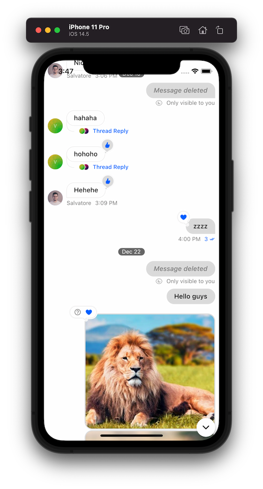
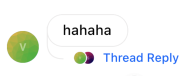

A Widget For Displaying A List Of Messages

Find the pub.dev documentation [here](https://pub.dev/documentation/stream_chat_flutter/latest/stream_chat_flutter/MessageListView-class.html)



### Background

Every channel can contain a list of messages sent by users inside it. The `MessageListView` widget
displays the list of messages inside a particular channel along with possible attachments and
other message attributes (if the message is pinned for example). This sets it apart from the `MessageSearchListView`
which may not contain messages only from a single channel and is used to search for messages across
many.

### Basic Example

The `MessageListView` shows the list of messages of the current channel. It has inbuilt support for
common messaging functionality: displaying and editing messages, adding / modifying reactions, support
for quoting messages, pinning messages, and more.

An example of how you can use the MessageListView is:

```dart
class ChannelPage extends StatelessWidget {
  const ChannelPage({
    Key key,
  }) : super(key: key);

  @override
  Widget build(BuildContext context) {
    return Scaffold(
      appBar: ChannelHeader(),
      body: Column(
        children: <Widget>[
          Expanded(
            child: MessageListView(
              threadBuilder: (_, parentMessage) {
                return ThreadPage(
                  parent: parentMessage,
                );
              },
            ),
          ),
          MessageInput(),
        ],
      ),
    );
  }
}
```

### Enable Threads

Threads are made of a parent message and replies linked to it. To enable threading, the SDK requires you
to supply a `threadBuilder` which will supply the page when the thread is clicked.

```dart
MessageListView(
    threadBuilder: (_, parentMessage) {
        return ThreadPage(
            parent: parentMessage,
        );
    },
),
```



The `MessageListView` itself can render the thread by supplying the `parentMessage` parameter.

```dart
MessageListView(
    parentMessage: parent,
),
```

### Building Custom Messages

You can also supply your own implementation for displaying messages using the `messageBuilder` parameter.

Note: To customize the existing implementation, look at the `MessageWidget` documentation instead.

```dart
MessageListView(
    messageBuilder: (context, details, messageList, defaultImpl) {
        // Your implementation of the message here
        // E.g: return Text(details.message.text ?? '');
    },
),
```

### Enabling Message Pinning

Message pins save and highlight the message in the `MessageListView`. To enable users to pin the message,
make sure the pin permissions are granted for different types of users on the dashboard. After confirming
the appropriate users have permissions, add the user types in the `pinPermissions` parameter.

```dart
MessageListView(
    //...
    pinPermissions: ['admin', 'userType1', 'userType2'],
),
```

This will allow these user types to pin messages through the message actions modal.


