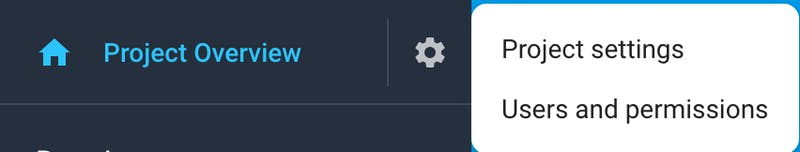
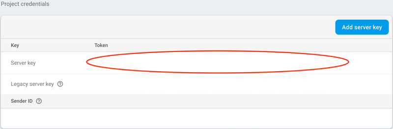
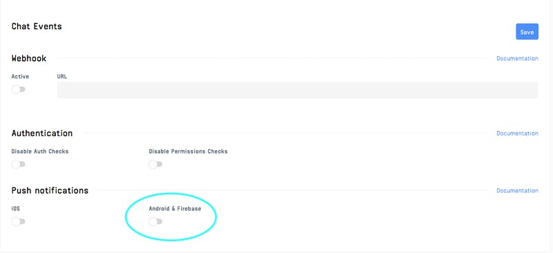
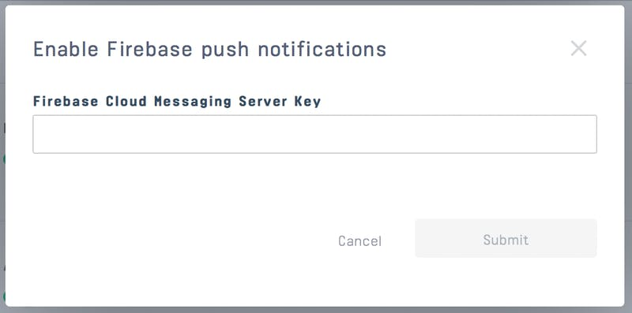
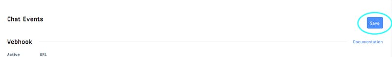

Adding Push Notifications To Your Application

:::note
Version 1 (legacy) of push notifications won't be removed immediately but there won't be any new features. That's why new applications are highly recommended to use version 2 from the beginning to leverage upcoming new features.
:::

### Introduction

Push notifications are a core part of the experience for a messaging app. Users often need to be notified
of new messages and old notifications sometimes need to be updated silently as well.

This guide details how to add push notifications to your app.

Make sure to check [this section](https://getstream.io/chat/docs/flutter-dart/push_introduction/?language=dart) of the docs to read about the push delivery logic.

### Setup FCM

To integrate push notifications in your Flutter app you need to use the package [`firebase_messaging`](https://pub.dev/packages/firebase_messaging).


Follow the [Firebase documentation](https://firebase.flutter.dev/docs/messaging/overview/) to know how to set up the plugin for both Android and iOS.


Once that's done FCM should be able to send push notifications to your devices.

### Integration with Stream

#### Step 1

From the [Firebase Console](https://console.firebase.google.com/), select the project your app belongs to.

#### Step 2

Click on the gear icon next to `Project Overview` and navigate to **Project settings**



#### Step 3

Navigate to the `Cloud Messaging` tab

#### Step 4

Under `Project Credentials`, locate the `Server key` and copy it



#### Step 5

Upload the `Server Key` in your chat dashboard






:::note
We are setting up the Android section, but this will work for both Android and iOS if you're using Firebase for both of them.
:::

#### Step 6

Save your push notification settings changes



**OR**

Upload the `Server Key` via API call using a backend SDK

```js
await client.updateAppSettings({ 
    firebase_config: { 
        server_key: 'server_key', 
        notification_template: `{"message":{"notification":{"title":"New messages","body":"You have {{ unread_count }} new message(s) from {{ sender.name }}"},"android":{"ttl":"86400s","notification":{"click_action":"OPEN_ACTIVITY_1"}}}}`, 
        data_template: `{"sender":"{{ sender.id }}","channel":{"type": "{{ channel.type }}","id":"{{ channel.id }}"},"message":"{{ message.id }}"}` 
    }, 
}); 
```

### Registering a device at Stream Backend

Once you configure Firebase server key and set it up on Stream dashboard a device that is supposed to receive push notifications needs to be registered at Stream backend. This is usually done by listening for Firebase device token updates and passing them to the backend as follows:

```dart
firebaseMessaging.onTokenRefresh.listen((token) { 
      client.addDevice(token, PushProvider.firebase); 
}); 
```

### Possible issues


We only send push notifications when the user doesn't have any active web socket connection (which is established when you call `client.connectUser`). If you set the [onBackgroundEventReceived](https://pub.dev/documentation/stream_chat_flutter/latest/stream_chat_flutter/StreamChat/onBackgroundEventReceived.html) property of the StreamChat widget, when your app goes to background, your device will keep the WS connection alive for 1 minute, and so within this period, you won't receive any push notification.

Make sure to read the [general push docs](https://getstream.io/chat/docs/flutter-dart/push_introduction/?language=dart) in order to avoid known gotchas that may make your relationship with notifications go bad 😢

### Testing if Push Notifications are Setup Correctly

If you're not sure if you've set up push notifications correctly (for example you don't always receive them, they work unreliably), you can follow these steps to make sure your configuration is correct and working:

1. Clone our repository for push testing git clone git@github.com:GetStream/chat-push-test.git

2. `cd flutter`

3. In folder run `flutter pub get`

4. Input your API key and secret in `lib/main.dart`

5. Change the bundle identifier/application ID and development team/user so you can run the app in your device (**do not** run on iOS simulator, Android emulator is fine)

6. Add your `google-services.json/GoogleService-Info.plist`

7. Run the app

8. Accept push notification permission (iOS only)

9. Tap on `Device ID` and copy it

10. Send the app to background

11. After configuring [stream-cli](https://github.com/GetStream/stream-cli) paste the following command on command line using your user ID

```shell
stream chat:push:test -u <USER-ID> 
```

You should get a test push notification

### App in the background but still connected

The [StreamChat](https://pub.dev/documentation/stream_chat_flutter/latest/stream_chat_flutter/StreamChat-class.html) widget lets you define a [onBackgroundEventReceived](https://pub.dev/documentation/stream_chat_flutter/latest/stream_chat_flutter/StreamChat/onBackgroundEventReceived.html) handler in order to handle events while the app is in the background, but the client is still connected.

This is useful because it lets you keep the connection alive in cases in which the app goes in the background just for some seconds (for example multitasking, picking pictures from the gallery...)

You can even customize the [backgroundKeepAlive](https://pub.dev/documentation/stream_chat_flutter/latest/stream_chat_flutter/StreamChat/backgroundKeepAlive.html) duration.

In order to show notifications in such a case we suggest using the package [`flutter_local_notifications`](https://pub.dev/packages/flutter_local_notifications); follow the package guide to successfully set up the plugin.

Once that's done you should set the [onBackgroundEventReceived](https://pub.dev/documentation/stream_chat_flutter/latest/stream_chat_flutter/StreamChat/onBackgroundEventReceived.html); here is an example:

```dart
... 
StreamChat( 
  client: client, 
  onBackgroundEventReceived: (e) { 
    final currentUserId = client.state.user.id; 
    if (![ 
          EventType.messageNew, 
          EventType.notificationMessageNew, 
        ].contains(event.type) || 
        event.user.id == currentUserId) { 
      return; 
    } 
    if (event.message == null) return; 
    final flutterLocalNotificationsPlugin = FlutterLocalNotificationsPlugin(); 
    final initializationSettingsAndroid = 
        AndroidInitializationSettings('launch_background'); 
    final initializationSettingsIOS = IOSInitializationSettings(); 
    final initializationSettings = InitializationSettings( 
      android: initializationSettingsAndroid, 
      iOS: initializationSettingsIOS, 
    ); 
    await flutterLocalNotificationsPlugin.initialize(initializationSettings); 
    await flutterLocalNotificationsPlugin.show( 
      event.message.id.hashCode, 
      event.message.user.name, 
      event.message.text, 
      NotificationDetails( 
        android: AndroidNotificationDetails( 
          'message channel', 
          'Message channel', 
          'Channel used for showing messages', 
          priority: Priority.high, 
          importance: Importance.high, 
        ), 
        iOS: IOSNotificationDetails(), 
      ), 
    ); 
  }, 
  child: .... 
); 
... 
```

As you can see we generate a local notification whenever a message.new or notification.message_new event is received.

### Foreground notifications

Sometimes you may want to show a notification when the app is in the foreground.
For example, when you're in a channel and you receive a new message from someone in another channel.

For this scenario, you can also use the `flutter_local_notifications` package to show a notification.

You need to listen for new events using `StreamChatClient.on` and handle them accordingly.

Here we're checking if the event is a `message.new` or `notification.message_new` event, and if the message is from a different user than the current user. In that case we'll show a notification.

```dart
client.on(
  EventType.messageNew,
  EventType.notificationMessageNew,
).listen((event) {
  if (event.message?.user?.id == client.state.currentUser?.id) {
    return;
  }
  showLocalNotification(event, client.state.currentUser!.id, context);
});
```

:::note
You should also check that the channel of the message is different than the channel in the foreground.
How you do this depends on your app infrastructure and how you handle navigation.
Take a look at the [Stream Chat v1 sample app](https://github.com/GetStream/flutter-samples/blob/main/packages/stream_chat_v1/lib/home_page.dart#L11) to see how we're doing it over there.
:::

### Saving notification messages to the offline storage

You may want to save received messages when you receive them via a notification so that later on when you open the app they're already there.

To do this we need to update the push notification data payload at Stream Dashboard and clear the notification one:

```json
{ 
  "message_id": "{{ message.id }}", 
  "channel_id": "{{ channel.id }}", 
  "channel_type": "{{ channel.type }}" 
}
```

Then we need to integrate the package [`stream_chat_persistence`](https://pub.dev/packages/stream_chat_persistence) in our app that exports a persistence client, learn [here](https://pub.dev/packages/stream_chat_persistence#usage) how to set it up.

Then during the call `firebaseMessaging.configure(...)` we need to set the `onBackgroundMessage` parameter using a TOP-LEVEL or STATIC function to handle background messages; here is an example:

```dart
Future<dynamic> myBackgroundMessageHandler(message) async { 
  if (message.containsKey('data')) { 
    final data = message['data']; 
    final messageId = data['message_id']; 
    final channelId = data['channel_id']; 
    final channelType = data['channel_type']; 
    final cid = '$channelType:$channelId'; 
 
    final client = StreamChatClient(apiKey); 
    final persistenceClient = StreamChatPersistenceClient(); 
    await persistenceClient.connect(userId); 
 
    final message = await client.getMessage(messageId).then((res) => res.message); 
 
    await persistenceClient.updateMessages(cid, [message]); 
    persistenceClient.disconnect(); 
 
    /// This can be done using the package flutter_local_notifications as we did before 👆 
    _showLocalNotification(); 
  } 
} 
```
